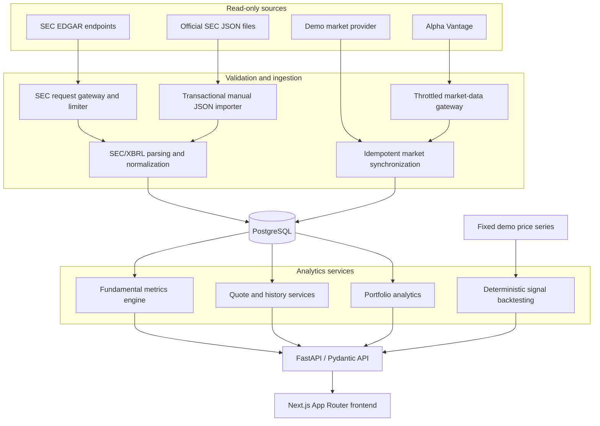

# InvestScope architecture

## System boundary

InvestScope is a read-only research system. External integrations supply public information; they never receive order instructions. User-entered portfolio positions describe ownership for analytics only and are not synchronized with a broker.

## Backend layers

- `backend/app/api`: HTTP validation and response mapping.
- `backend/app/modules`: provider contracts, synchronization, normalization, and analytics.
- `backend/app/repositories`: SQLAlchemy persistence and point-in-time queries.
- `backend/app/models`: PostgreSQL entities and constraints.
- `backend/app/schemas`: Pydantic request and response contracts.
- `backend/alembic`: ordered PostgreSQL migrations.

Analytics services depend on provider-neutral contracts. Alpha Vantage and SEC network behavior remains inside dedicated gateways; API handlers do not construct raw external HTTP requests.

## Market-data flow

1. The configured `MarketDataProvider` validates and normalizes a symbol.
2. The synchronization endpoint applies freshness, daily-budget, and request-interval guards.
3. Every external Alpha Vantage request passes through the shared throttled gateway.
4. OHLCV rows are validated before persistence: UTC timestamps, Decimal prices, nonnegative volume, and consistent OHLC relationships.
5. `MarketBar` uniqueness is enforced by asset, timeframe, event time, and provider.
6. Repeated synchronization updates matching rows instead of inserting duplicates.
7. Asset, history, latest-price, portfolio, and fundamental-valuation queries use the configured provider unless an explicit supported diagnostic override is supplied.

Daily freshness has two dimensions: `is_fetch_stale` describes how long ago InvestScope received data, while `is_market_data_stale` checks whether the latest expected completed weekday session is present.

## SEC ingestion flow

### Live read-only path

`SecEdgarRequestGateway` applies one shared limiter across `www.sec.gov` and `data.sec.gov`. Company resolution checks persisted `Asset.cik`, then the persistent ticker cache, and requests the ticker index only when required. Rate limits and access denial are returned as distinct stable error categories, with no automatic retry.

### Offline path

The CLI importer reads local official submissions and companyfacts JSON. It validates file type, size, JSON structure, CIK consistency, filings, and facts before committing. It uses the same parsers and XBRL mapping as live synchronization, records `provider="sec_edgar"` with `ingestion_method="manual_json"`, and is transactional and idempotent. No public upload endpoint exists.

Local SEC JSON is intentionally excluded from Git because these files can be large and represent machine-local import inputs.

## Fundamental metrics engine

Raw `FinancialFact` rows remain immutable. The metrics engine builds canonical period buckets and selects facts deterministically using actual period dates, unit, concept priority, filing publication time, amendment state, and conflict rules.

Supported output periods include quarterly, annual, and TTM. Duration metrics can derive fiscal Q4 from annual and quarterly operands, while cash-flow quarters can be derived from YTD differences. Derived values are response-time analytics and are never inserted as raw SEC facts.

TTM requires four sequential, non-overlapping canonical quarters. Annual, YTD, and repeated comparative values cannot be counted as additional quarters.

## Provenance model

- `selected_fact`: the canonical directly reported fact.
- `alternative_facts`: other eligible candidates, included only when requested.
- `source_facts`: complete evidence considered for selection or calculation.
- `calculation_components`: the exact unique operands used mathematically.

A comparative fact may remain in `source_facts` for auditability while being absent from `calculation_components`. This prevents double counting without hiding source evidence. The frontend renders calculation operands separately from the broader provenance audit.

## Point-in-time semantics

All datetimes are timezone-aware and normalized to UTC.

For an `as_of` request:

- a fact must have been filed by `as_of`;
- its filing acceptance time, when available, must also be no later than `as_of`;
- an amendment cannot affect earlier results;
- a derived metric is unavailable until every required operand has been published;
- market valuation uses only a persisted price whose event and receipt timestamps are not later than `as_of`.

This prevents future filings, amended values, or future market observations from leaking into historical analysis.

## Portfolio analytics

Positions are entered manually. Current valuation uses available persisted quotes and exposes their provider and receipt time. Positions without a quote are marked unvalued and excluded from percentage-return calculations; their count and recorded cost remain visible separately.

The service provides allocation, concentration, volatility, drawdown, correlation, political/geographic exposure, stress scenarios, and news-impact demonstrations. It does not create orders or connect to external accounts.

## Backtesting

The backtesting module evaluates analytical SMA-crossover signals on a fixed deterministic demonstration series. The endpoint returns the signal curve, baseline curve, return, drawdown, Sharpe ratio, and signal counts. No random values, brokerage actions, or execution model are involved.

## API surface

Primary read-only market-data endpoints:

- `GET /api/assets`
- `GET /api/assets/{symbol}`
- `GET /api/market/{symbol}/history`
- `GET /api/market/{symbol}/latest`
- `GET /api/providers/market-data/status`
- `POST /api/market/{symbol}/sync` — explicit read-only ingestion

Fundamental endpoints:

- `GET /api/fundamentals/{symbol}/profile`
- `GET /api/fundamentals/{symbol}/filings`
- `GET /api/fundamentals/{symbol}/facts`
- `GET /api/fundamentals/{symbol}/metrics`
- `POST /api/fundamentals/{symbol}/sync` — explicit read-only ingestion

Legacy analytical endpoints under `/api/v1` include dashboard, portfolio, political events, recommendations, and `POST /api/v1/backtesting/run`.

System health is available at `GET /health`.

## Operational safeguards

- secrets are loaded from ignored environment files and API keys use `SecretStr`;
- provider status responses do not expose credentials;
- missing numeric values remain null rather than becoming false zeroes;
- PostgreSQL-specific schema changes use Alembic;
- provider calls are never triggered automatically by simply opening an asset page;
- test suites mock external providers and perform no real SEC request.
